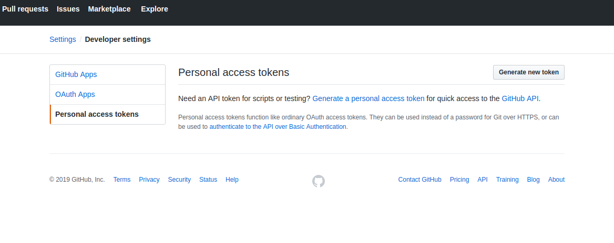
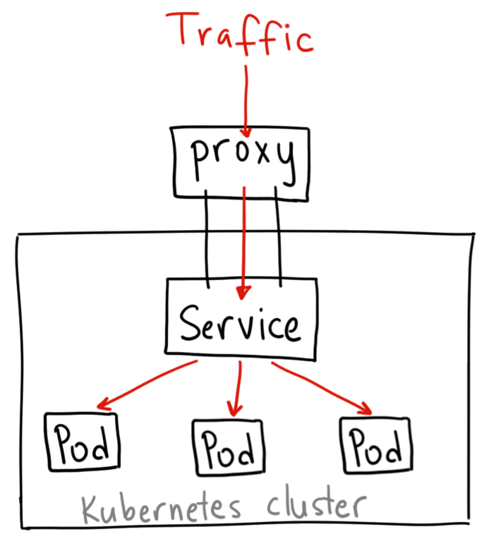
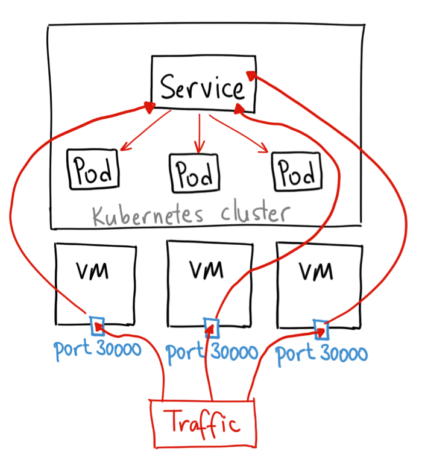
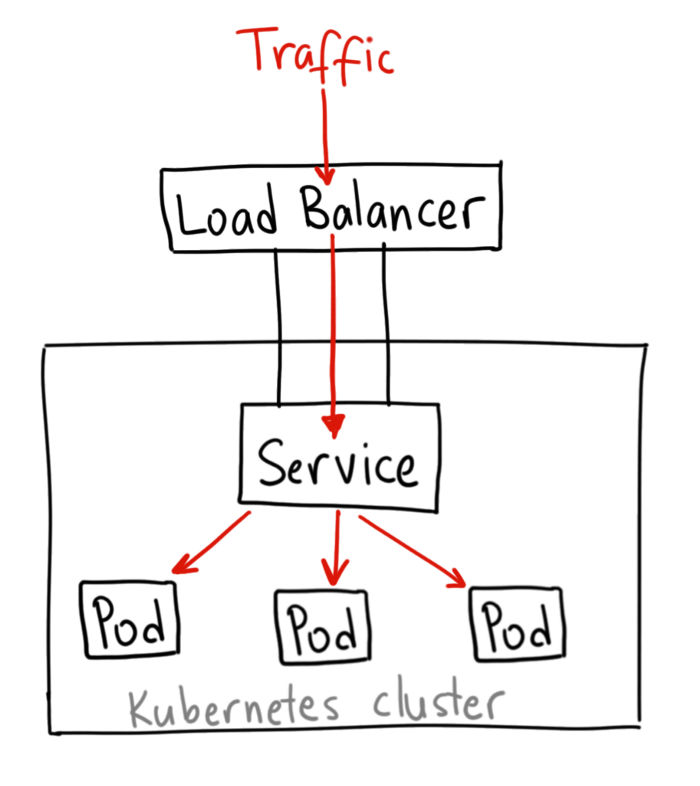
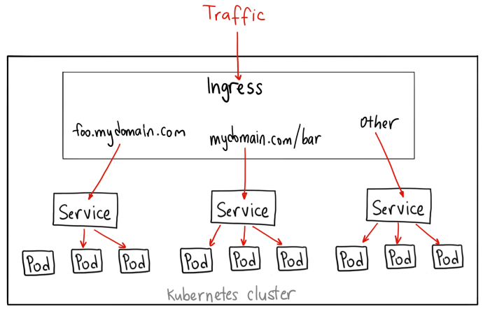

[](https://faun.dev/join?utm_source=faun&utm_medium=github&utm_campaign=kubernetes-workshop)

- Slides available [here](https://slides.com/eon01/kubernetes-workshop#/).
- Original article posted [here](https://medium.com/faun/a-gentle-introduction-to-kubernetes-4961e443ba26).
- Source code [here](https://github.com/eon01/kubernetes-workshop).

# Introduction

In this workshop, we're going to:

- Deploy Kubernetes services and an Ambassador API gateway.
- Examine the difference between Kubernetes proxies and service mesh like Istio.
- Access the Kubernetes API from the outside and from a Pod.
- Understand what API to choose.
- See how Service Accounts and RBAC works
- Discover some security pitfalls when building Docker images and many interesting things.
- Other things :-)

We will start by developing then deploying a simple Python application (a Flask API that returns the list of trending repositories by programming language).

## Development Environment

We are going to use Python 3.6.7


We are using Ubuntu 18.04 that comes with Python 3.6 by default. You should be able to invoke it with the command python3. (Ubuntu 17.10 and above also come with Python 3.6.7)

If you use Ubuntu 16.10 and 17.04, you should be able to install it with the following commands:

```bash
sudo apt-get update
sudo apt-get install python3.6
```

If you are using Ubuntu 14.04 or 16.04, you need to get Python 3 from a Personal Package Archive (PPA):

```bash
sudo add-apt-repository ppa:deadsnakes/ppa
sudo apt-get update
sudo apt-get install python3.6
```

For the other operating systems, visit [this guide](https://realpython.com/installing-python/), follow the instructions and install Python3.

Now install PIP, the package manager:

```bash
sudo apt-get install python3-pip
```

Follow this by the installation of Virtualenvwrapper, which is a virtual environment manager:

```bash
sudo pip3 install virtualenvwrapper
```

Create a folder for your virtualenvs (I use ~/dev/PYTHON_ENVS) and set it as WORKON_HOME:

```bash
mkdir  ~/dev/PYTHON_ENVS
export WORKON_HOME=~/dev/PYTHON_ENVS
```

In order to source the environment details when the user login, add the following lines to ~/.bashrc:

```bash
source "/usr/local/bin/virtualenvwrapper.sh"
export WORKON_HOME="~/dev/PYTHON_ENVS"
```

Make sure to adapt the WORKON_HOME to your real WORKON_HOME.
Now we need to create then activate the new environment:

```bash
mkvirtualenv --python=/usr/bin/python3 trendinggitrepositories
workon trendinggitrepositories
```

Let's create the application directories:

```bash
mkdir trendinggitrepositories
cd trendinggitrepositories
mkdir api
cd api
```

Once the virtual environment is activated, we can install Flask:

```bash
pip install flask
```


## Developing a Trending Git Repositories API (Flask)

Inside the API folder `api`, create a file called `app.py` and add the following code:

```python
from flask import Flask

app = Flask(__name__)

@app.route('/')
def index():
    return "Hello, World!"

if __name__ == '__main__':
    app.run(debug=True)
```

This will return a hello world message when a user requests the "/" route.

Now run it using: `python app.py` and you will see a similar output to the following one:

```
* Serving Flask app "api" (lazy loading)
* Environment: production
  WARNING: This is a development server. Do not use it in a production deployment.
  Use a production WSGI server instead.
* Debug mode: on
* Running on http://127.0.0.1:5000/ (Press CTRL+C to quit)
* Restarting with stat
* Debugger is active!
* Debugger PIN: 465-052-587
```




We now need to install PyGithub since we need it to communicate with Github API v3.

```bash
pip install PyGithub
```

Go to Github and [create a new app](https://github.com/settings/applications/new). We will need the application "Client ID" and "Client Secret":

```python
from github import Github
g = Github("xxxxxxxxxxxxx", "xxxxxxxxxxxxxxxxxxxxxxxxxxxxxx")
```

This is how the mini API looks like:

```python
from flask import Flask, jsonify, abort
import urllib.request, json
from flask import request

app = Flask(__name__)

from github import Github
g = Github("xxxxxx", "xxxxxxxxxxxxx")

@app.route('/')
def get_repos():
    r = []

    try:
        args = request.args
        n = int(args['n'])
    except (ValueError, LookupError) as e:
        abort(jsonify(error="No integer provided for argument 'n' in the URL"))

    repositories = g.search_repositories(query='language:python')[:n]

    for repo in repositories:
        with urllib.request.urlopen(repo.url) as url:
            data = json.loads(url.read().decode())
        r.append(data)

    return jsonify({'repos':r })

if __name__ == '__main__':
    app.run(debug=True)
```

Let's hide the Github token and secret as well as other variables in the environment.

```python
from flask import Flask, jsonify, abort, request
import urllib.request, json, os
from github import Github

app = Flask(__name__)

CLIENT_ID = os.environ['CLIENT_ID']
CLIENT_SECRET = os.environ['CLIENT_SECRET']
DEBUG = os.environ['DEBUG']

g = Github(CLIENT_ID, CLIENT_SECRET)


@app.route('/')
def get_repos():
    r = []

    try:
        args = request.args
        n = int(args['n'])
    except (ValueError, LookupError) as e:
        abort(jsonify(error="No integer provided for argument 'n' in the URL"))

    repositories = g.search_repositories(query='language:python')[:n]

    for repo in repositories:
        with urllib.request.urlopen(repo.url) as url:
            data = json.loads(url.read().decode())
        r.append(data)

    return jsonify({'repos':r })

if __name__ == '__main__':
    app.run(debug=DEBUG)
```

The code above will return the top "n" repositories using Python as a programming language. We can use other languages too:

```python
from flask import Flask, jsonify, abort, request
import urllib.request, json, os
from github import Github

app = Flask(__name__)

CLIENT_ID = os.environ['CLIENT_ID']
CLIENT_SECRET = os.environ['CLIENT_SECRET']
DEBUG = os.environ['DEBUG']

g = Github(CLIENT_ID, CLIENT_SECRET)


@app.route('/')
def get_repos():
    r = []

    try:
        args = request.args
        n = int(args['n'])
        l = args['l']
    except (ValueError, LookupError) as e:
        abort(jsonify(error="Please provide 'n' and 'l' parameters"))

    repositories = g.search_repositories(query='language:' + l)[:n]


    try:
        for repo in repositories:
            with urllib.request.urlopen(repo.url) as url:
                data = json.loads(url.read().decode())
            r.append(data)
        return jsonify({
            'repos':r,
            'status': 'ok'
            })
    except IndexError as e:
        return jsonify({
            'repos':r,
            'status': 'ko'
            })

if __name__ == '__main__':
    app.run(debug=DEBUG)
```

In a .env file, add the variables you want to use:

```
CLIENT_ID="xxxxx"
CLIENT_SECRET="xxxxxx"
ENV="dev"
DEBUG="True"
```

Before running the Flask application, you need to source these variables:

```bash
source .env
```


Now, you can go to `http://0.0.0.0:5000/?n=1&l=python` to get the trendiest Python repository or `http://0.0.0.0:5000/?n=1&l=c` for C programming language.
Here is a list of other programming languages you can test your code with:

```
C++
Assembly
Objective
Makefile
Shell
Perl
Python
Roff
Yacc
Lex
Awk
UnrealScript
Gherkin
M4
Clojure
XS
Perl
sed
```

The list is long, but our mini API is working fine.
Now, let's freeze the dependencies:

```bash
pip freeze > requirements.txt
```

Before running the API on Kubernetes, let's create a Dockerfile. This is a typical Dockerfile for a Python app:

```
FROM python:3
ENV PYTHONUNBUFFERED 1
RUN mkdir /app
WORKDIR /app
COPY requirements.txt /app
RUN pip install --upgrade pip
RUN pip install -r requirements.txt
COPY . /app
EXPOSE 5000
CMD [ "python", "app.py" ]
```

Now you can build it:

```bash
docker build --no-cache -t tgr .
```

Then run it:

```bash
docker rm -f tgr
docker run --it  --name tgr -p 5000:5000 -e CLIENT_ID="xxxxxxx" -e CLIENT_SECRET="xxxxxxxxxxxxxxx" -e DEBUG="True" tgr
```


Let's include some other variables as environment variables:

```python
from flask import Flask, jsonify, abort, request
import urllib.request, json, os
from github import Github

app = Flask(__name__)

CLIENT_ID = os.environ['CLIENT_ID']
CLIENT_SECRET = os.environ['CLIENT_SECRET']
DEBUG = os.environ['DEBUG']
HOST = os.environ['HOST']
PORT = os.environ['PORT']

g = Github(CLIENT_ID, CLIENT_SECRET)


@app.route('/')
def get_repos():
    r = []

    try:
        args = request.args
        n = int(args['n'])
        l = args['l']
    except (ValueError, LookupError) as e:
        abort(jsonify(error="Please provide 'n' and 'l' parameters"))

    repositories = g.search_repositories(query='language:' + l)[:n]


    try:
        for repo in repositories:
            with urllib.request.urlopen(repo.url) as url:
                data = json.loads(url.read().decode())
            r.append(data)
        return jsonify({
            'repos':r,
            'status': 'ok'
            })
    except IndexError as e:
        return jsonify({
            'repos':r,
            'status': 'ko'
            })

if __name__ == '__main__':
    app.run(debug=DEBUG, host=HOST, port=PORT)
```

For security reasons, let's change the user inside the container from root to a user with less rights that we create:

```
FROM python:3
ENV PYTHONUNBUFFERED 1
RUN adduser pyuser

RUN mkdir /app
WORKDIR /app
COPY requirements.txt /app
RUN pip install --upgrade pip
RUN pip install -r requirements.txt
COPY . .
RUN chmod +x app.py

RUN chown -R pyuser:pyuser /app
USER pyuser


EXPOSE 5000
CMD ["python","./app.py"]
```

Now if we want to run the container, we need to add many environment variables to the docker run command. An easier solution is using `--env-file    ` with Docker run:

```bash
docker run -it --env-file .env my_container
```

Our .env file looks like the following one:

```
CLIENT_ID="xxxx"
CLIENT_SECRET="xxxx"
ENV="dev"
DEBUG="True"
HOST="0.0.0.0"
PORT=5000
```

After this modification, rebuild the image `docker build -t tgr .` and run it using:

```bash
docker rm -f tgr;
docker run -it  --name tgr -p 5000:5000 --env-file .env  tgr
```

Our application runs using `python app.py` which is the webserver that ships with Flask and t's great for development and local execution of your program, however, it's not designed to run in a production mode, whether it's a monolithic app or a microservice.

A production server typically receives abuse from spammers, script kiddies, and should be able to handle high traffic. In our case, a good solution is using a WSGI HTTP server like Gunicorn (or uWsgi).

First, let's install `gunicorn` with the following command: `pip install gunicorn`. This will require us to update our `requirements.txt` with `pip freeze > requirements.txt`

This is why we are going to change our Docker file:

```
FROM python:3
ENV PYTHONUNBUFFERED 1
RUN adduser pyuser

RUN mkdir /app
WORKDIR /app
COPY requirements.txt /app
RUN pip install --upgrade pip
RUN pip install -r requirements.txt
COPY . .
RUN chmod +x app.py

RUN chown -R pyuser:pyuser /app
USER pyuser


EXPOSE 5000
CMD ["gunicorn", "app:app", "-b", "0.0.0.0:5000"]
```

In order to optimize the Wsgi server, we need to set the number of its workers and threads to:

```
workers = multiprocessing.cpu_count() * 2 + 1
threads = 2 * multiprocessing.cpu_count()
```

This is why we are going to create another Python configuration file (`config.py`):

```python
import multiprocessing
workers = multiprocessing.cpu_count() * 2 + 1
threads = 2 * multiprocessing.cpu_count()
```

In the same file, we are going to include other configurations of Gunicorn:

```python
from os import environ as env
bind = env.get("HOST","0.0.0.0") +":"+ env.get("PORT", 5000)
```

This is the final `config.py` file:

```python
import multiprocessing
workers = multiprocessing.cpu_count() * 2 + 1
threads = 2 * multiprocessing.cpu_count()

from os import environ as env
bind = env.get("HOST","0.0.0.0") +":"+ env.get("PORT", 5000)
```

In consequence, we should adapt the Dockerfile to the new Gunicorn configuration by changing the last line to :

```
CMD ["gunicorn", "app:app", "--config=config.py"]
```

Now, build `docker build -t tgr .` and run ` docker run -it --env-file .env -p 5000:5000 tgr`.


# Pushing the Image to a Remote Registry

A Docker registry is a storage and distribution system for named Docker images.

The images we built are stored in our local environment and can only be used if you deploy locally. However, if you choose to deploy a Kubernetes cluster in a cloud or any different environment, these images will be not found. This is why we need to push the build images to a remote registry.

Think of container registries as a git system for Docker images.

There are plenty of containers registries:

- Dockerhub
- Amazon Elastic Registry (ECR)
- Azure Container Registry (ACR)
- Google Container Registry (GCR)
- CoreOS Quay

You can also host your private container registry that supports OAuth, LDAP and Active Directory authentication using the registry provided by Docker:

```bash
docker run -d -p 5000:5000 --restart=always --name registry registry:2
```

More about self-hosting a registry can be found in [the official Docker documentation](https://docs.docker.com/registry/deploying/).

We are going to use Dockerhub; this is why you need to create an account on [hub.docker.com](https://hub.docker.com/).

Now, using Docker CLI, login:

```bash
docker login
```

Now rebuild the image using the new tag:

``` &lt;username&gt;/&lt;image_name&gt;:&lt;tag_version&gt;
 docker build -t <username>/<image_name>:<tag_version> .
```

Example:

```bash
docker build -t eon01/tgr:1 .
```

Finally, push the image:

```bash
docker push eon01/tgr:1
```


## A Security Notice

Many of the publicly (and even private Docker images) seems to be secure, but it's not the case. When we built our image, we told Docker to copy all the images from the application folder to the image and we push it to an external public registry.

```C
COPY . .        
```

Or

```
ADD . .
```

The above commands will even copy the `.env` file containing our secrets.

A good solution is to tell Docker to ignore these files during the build using a .dockeringore file:

```
**.git
**.gitignore
**README.md
**env.*
**Dockerfile*
**docker-compose*
**.env
```

At this stage, you should remove any image that you pushed to a distant registry, reset the Github tokens, build the new image without any cache:

```bash
docker build -t eon01/tgr:1 . --no-cache
```

Push it again:

```bash
docker push eon01/tgr:1
```


# Installing Minikube

One of the fastest ways to try Kubernetes is using Minkube, which will create a virtual machine for you and deploy a ready-to-use Kubernetes cluster.

Before you begin the installation, you need to make sure that your laptop supports virtualization:

If your using Linux, run the following command and make sure that the output is not empty:

```bash
grep -E --color 'vmx|svm' /proc/cpuinfo
```

Mac users should execute:

```bash
sysctl -a | grep -E --color 'machdep.cpu.features|VMX'
```

If you see `VMX` in the output, the VT-x feature is enabled in your machine.

Windows users should use `systeminfo` and you should see the following output:

```
Hyper-V Requirements:     VM Monitor Mode Extensions: Yes
                          Virtualization Enabled In Firmware: Yes
                          Second Level Address Translation: Yes
                          Data Execution Prevention Available: Yes
```

If everything is okay, you need to install a hypervisor. You have a list of possibilities here:

- [KVM](https://www.linux-kvm.org/)
- [VirtualBox](https://www.virtualbox.org/wiki/Downloads)
- [HyperKit](https://github.com/moby/hyperkit)
- [VMware Fusion](https://www.vmware.com/products/fusion)
- [Hyper-V](https://msdn.microsoft.com/en-us/virtualization/hyperv_on_windows/quick_start/walkthrough_install)

Some of these hypervisors are only compatible with some OSs like Hyper-V (formerly known as Windows Server Virtualization) for windows.

VirtualBox is however cross-platform, and this is why we are going to use it here. Make sure to [follow the instructions](https://www.virtualbox.org/wiki/Downloads) to install it.

Now, install Minikube.

Linux systems:

```bash
curl -Lo minikube https://storage.googleapis.com/minikube/releases/latest/minikube-linux-amd64 && chmod +x minikube
sudo install minikube /usr/local/bin
```

MacOs:

```bash
brew cask install minikube
curl -Lo minikube https://storage.googleapis.com/minikube/releases/latest/minikube-darwin-amd64 && chmod +x minikube
sudo mv minikube /usr/local/bin
```

Windows:

Use Chocolatey as an administrator:

```bash
choco install minikube
```

Or use [the installer binary](https://github.com/kubernetes/minikube/releases/latest/download/minikube-installer.exe).

Minikube does not support all Kubernetes features (like load balancing for example), however, you can find the most important features there:

Minikube supports the following Kubernetes features:

- DNS
- NodePorts
- ConfigMaps and Secrets
- Dashboards
- Container Runtime: Docker, [rkt](https://github.com/rkt/rkt), [CRI-O](https://github.com/kubernetes-incubator/cri-o), and [containerd](https://github.com/containerd/containerd)
- Enabling CNI (Container Network Interface)
- Ingress

You can also add different addons like:

- addon-manager
- dashboard
- default-storageclass
- efk
- freshpod
- gvisor
- heapster
- ingress
- logviewer
- metrics-server
- nvidia-driver-installer
- nvidia-gpu-device-plugin
- registry
- registry-creds
- storage-provisioner
- storage-provisioner-gluster

If you run `minikube start` a cluster called minikube will be created; however, you have other choices rather than just creating a regular Minikube cluster. In this example, we are going to create a cluster called "workshop", enable a UI to browse the API and activate tailing logs:

```bash
minikube start -p workshop --extra-config=apiserver.enable-swagger-ui=true --alsologtostderr
```

You have plenty of other options to start a Minikube cluster; you can, for instance, choose the Kubernetes version and the VM driver:

```bash
minikube start --kubernetes-version="v1.12.0" --vm-driver="virtualbox"  
```

Start the new cluster:

```bash
minikube start -p workshop --extra-config=apiserver.enable-swagger-ui=true --alsologtostderr
```

You can get detailed information about the cluster using:

```bash
kubectl cluster-info
```

If you didn't install kubectl, [follow the official instructions](https://kubernetes.io/docs/tasks/tools/install-kubectl).

You can open the dashboard using `minikube -p workshop dashboard `


# Deploying to Kubernetes

We have three main ways to deploy our container to Kubernetes and scale it to N replica.

The first one is the original form of replication in Kubernetes, and it's called **Replication Controller**.

Even if Replica Sets replace it, it's still used in some codes.

This is a typical example:

```yaml
apiVersion: v1
kind: ReplicationController
metadata:
  name: app
spec:
  replicas: 3
  selector:
    app: app
  template:
    metadata:
      name: app
      labels:
        app: app
    spec:
      containers:
      - name: tgr
        image: reg/app:v1
        ports:
        - containerPort: 80
```

We can also use Replica Sets, another way to deploy an app and replicate it:

```yaml
apiVersion: extensions/v1beta1
 kind: ReplicaSet
 metadata:
   name: app
 spec:
   replicas: 3
   selector:
     matchLabels:
       app: app
   template:
     metadata:
       labels:
         app: app
         environment: dev
     spec:
       containers:
       - name: app
         image: reg/app:v1
         ports:
         - containerPort: 80
```

Replica Set and Replication Controller do almost the same thing.

They ensure that you have a specified number of pod replicas running at any given time in your cluster.

There are however, some differences.

As you may notice, we are using `matchLabels` instead of `label`.

Replica Set use Set-Based selectors while replication controllers use Equity-Based selectors.

Selectors match Kubernetes objects (like pods) using the constraints of the specified label, and we are going to see an example in a Deployment specification file.

**Label selectors** with **equality-based requirements** use three operators:`=`,`==` and `!=`.

```
environment = production
tier != frontend
app == my_app (similar to app = my_app)
```

In the last example, we used this notation:

```
 ...
 spec:
   replicas: 3
   selector:
     matchLabels:
       app: app
   template:
     metadata:
...     
```


We could have used  **set-based requirements**:

```
...
spec:
   replicas: 3
   selector:
     matchExpressions:
      - {key: app, operator: In, values: [app]}     
  template:
     metadata:
...
```


If we have more than 1 value for the app key, we can use:

```
...
spec:
   replicas: 3
   selector:
     matchExpressions:
      - {key: app, operator: In, values: [app, my_app, myapp, application]}     
  template:
     metadata:
...
```

And if we have other keys, we can use them like in the following example:

 ```
...
spec:
   replicas: 3
   selector:
     matchExpressions:
      - {key: app, operator: In, values: [app]}
      - {key: tier, operator: NotIn, values: [frontend]}
      - {key: environment, operator: NotIn, values: [production]}
template:
     metadata:
...
 ```

Newer Kubernetes resources such as Jobs, Deployments, ReplicaSets, and DaemonSets all support set-based requirements as well.

This is an example of how we use Kubectl with selectors :

```bash
kubectl delete pods -l 'env in (production, staging, testing)'
```


Until now, we have seen that the Replication Controller and Replica Set are two ways to deploy our container and manage it in a Kubernetes cluster. However, the recommended approach is using a Deployment that configures a ReplicaSet.

It is rather unlikely that we will ever need to create Pods directly for a production use-case since Deployments manages to create Pods for us through ReplicaSets.

This is a simple Pod definition:

```yaml
apiVersion: v1
kind: Pod
metadata:
  name: infinite
  labels:
    env: production
    owner: eon01
spec:
  containers:
  - name: infinite
    image: eon01/infinite
```

In practice, we need:

1. **A Deployment object** : Containers are specified here.
2. **A Service object**: An abstract way to expose an application running on a set of Pods as a network service.

This is a Deployment object that creates three replicas of the container app running the image "reg/app:v1". These containers can be reached using port 80:

```yaml
apiVersion: extensions/v1beta1
kind: Deployment
metadata:
  name: app
spec:
  replicas: 3
  template:
    metadata:
      labels:
        app: app
    spec:
      containers:
      - name: app
        image: reg/app:v1
        ports:
        - containerPort: 80
```

This is the Deployment file we will use (save it to `kubernetes/api-deployment.yaml`:

```yaml
apiVersion: apps/v1
kind: Deployment
metadata:
  name: tgr
  labels:
    name: tgr
spec:
  replicas: 1
  selector:
    matchLabels:
      name: tgr
  template:
    metadata:
      name: tgr
      labels:
        name: tgr
    spec:
      containers:
        - name: tgr
          image: eon01/tgr:1
          ports:
            - containerPort: 5000
          resources:
            requests:
              memory: 128Mi
            limits:
              memory: 256Mi
          env:
            - name: CLIENT_ID
              value: "xxxx"
            - name: CLIENT_SECRET
              value: "xxxxxxxxxxxxxxxxxxxxx"
            - name: ENV
              value: "prod"
            - name: DEBUG
              value: "False"
            - name: HOST
              value: "0.0.0.0"
            - name: PORT
              value: "5000"
```

Let's first talk about the API version; in the first example, we used the `extensions/v1beta1` and in the second one, we used  `apps/v1`. You may know that Kubernetes project development is very active, and it may be confusing sometimes to follow all the software updates.

In Kubernetes version 1.9, `apps/v1` is introduced, and `extensions/v1beta1`, `apps/v1beta1` and `apps/v1beta2` are deprecated.

To make things simpler, to know which version of the API you need to use, use the command:

```bash
kubectl api-versions
```

This above command will give you the API versions compatible with your cluster.

- **v1** was the first stable release of the Kubernetes API. It contains many core objects.

- **apps/v1** is the most popular API group in Kubernetes, and it includes functionality related to running applications on Kubernetes, like Deployments, RollingUpdates, and ReplicaSets.

- **autoscaling/v1 **allows pods to be autoscaled based on different resource usage metrics.

- **batch/v1** is related to batch processing and and jobs

- **batch/v1beta1** is the beta release of batch/v1

- **certificates.k8s.io/v1beta1** validates network certificates for secure communication in your cluster.

- **extensions/v1beta1**  includes many new, commonly used features. In Kubernetes 1.6, some of these features were relocated from `extensions` to specific API groups like `apps` .

- **policy/v1beta1** enables setting a pod disruption budget and new pod security rules

- **rbac.authorization.k8s.io/v1** includes extra functionality for Kubernetes RBAC (role-based access control)
- ..etc


Let's deploy the pod now using the Deployment file we created.

```bash
kubcetl apply -f kubernetes/api-deployment.yaml
```

Note that you can use `kubectl create -f kubernetes/api-deployment.yaml` command. However, there's a difference, between `apply` and `create`.


`kubectl create` is what we call [Imperative Management of Kubernetes Objects Using Configuration Files](https://kubernetes.io/docs/tutorials/object-management-kubectl/imperative-object-management-configuration/). `kubectl create` overwrites all changes, and if a resource is having the same id already exists, it will encounter an error.

Using this approach, you tell the Kubernetes API what you want to create, replace, or delete, not how you want your K8s cluster world to look like.

`kubectl apply` is what we call [Declarative Management of Kubernetes Objects Using Configuration Files](https://kubernetes.io/docs/tutorials/object-management-kubectl/declarative-object-management-configuration/) approach. `kubectl apply` makes incremental changes. If an object already exists and you want to apply a new value for replica without deleting and recreating the object again, then `kubectl apply` is what you need. `kubcetl apply` can also be used even if the object (e.g deployment) does not exist yet.

In the Deployment configuration, we also defined our container. We will run a single container here since the replica is set to `1`. In the same time, our container will use the image `eon01/tgr:1`. Since our container will need some environment variables, the best way is to provide them using the Kubernetes deployment definition file.

Also, we can add many other configurations, like the requested memory and its limit. The goal here is not using all that Kubernetes allows is to use in a Deployment file, but to see some of the essential features.

```yaml
    spec:
      containers:
        - name: tgr
          image: eon01/tgr:1
          ports:
            - containerPort: 5000
          resources:
            requests:
              memory: 128Mi
            limits:
              memory: 256Mi
          env:
            - name: CLIENT_ID
              value: "xxxx"
            - name: CLIENT_SECRET
              value: "xxxxxxxxxxxxxxxxxxxxx"
            - name: ENV
              value: "prod"
            - name: DEBUG
              value: "False"
            - name: HOST
              value: "0.0.0.0"
            - name: PORT
              value: "5000"
```

In some cases, the Docker registry can be private, and in this case, pulling the image needs authentication. In this case, we need to add the `imagePullSecrets ` configuration:

```
...
  containers:
  - name: private-reg-container
    image: <your-private-image>
  imagePullSecrets:
  - name: registry-credentials
  ...
```

This is how the `registry-credentials` secret is created:

```bash
kubectl create secret docker-registry registry-credentials --docker-server=<your-registry-server> --docker-username=<your-name> --docker-password=<your-pword> --docker-email=<your-email>
```

You can also apply/create the `registry-credentials` using a YAML file. This is an example:

```yaml
apiVersion: v1
kind: Secret
metadata:
  ...
  name: registry-credentials
  ...
data:
  .dockerconfigjson: adjAalkazArrA ... JHJH1QUIIAAX0=
type: kubernetes.io/dockerconfigjson
```

If you decode the .dockerconfigjson file using `base64 --decode` command, you will understand that it's a simple file storing the configuration to access a registry:

```bash
kubectl get secret regcred --output="jsonpath={.data.\.dockerconfigjson}" | base64 --decode
```

You will get a similar output to the following one:

```json
{"auths":{"your.private.registry.domain.com":{"username":"eon01","password":"xxxxxxxxxxx","email":"aymen@eralabs.io","auth":"dE3xxxxxxxxx"}}}
```

Again, let's decode the "auth" value using `echo "dE3xxxxxxxxx"|base64 --decode ` and it will give you something like `eon01:xxxxxxxx` which has the format `username:password`.

Now let's see if the deployment is done, let's see how many pods we have:

```bash
kubectl get pods
```

This command will show all the pods within a cluster.

We can scale our deployment using a command similar to the following one:

```bash
kubectl scale --replicas=<expected_replica_num> deployment <deployment_name>
```

Our deployment is called `tgr` since it's the name we gave to it in the Deployment configuration. You can also make verification by typing `kubeclt get deployment`. Let's scale it:

```bash
kubectl scale --replicas=2 deployment tgr
```

Each of these containers will be accessible on port 500 from outside the container but not from outside the cluster.

The number of pods/containers running for our API can be variable and may change dynamically.

We can set up a load balancer that will balance traffic between the two pods we created, but since each pod can disappear to be recreated, its hostname and address will change.

In all cases, pods are not meant to receive traffic directly, but they need to be exposed to traffic using a Service. In other words, the set of Pods running in one moment in time could be different from the set of Pods running that application a moment later.

At the moment, the only service running is the cluster IP (which is related to Minikube and give us access to the cluster we created):

```bash
kubectl get services
```

## Services

In Kubernetes, since Pods are mortals, we should create an abstraction that defines a logical set of Pods and how to access them. This is the role of Services.

In our case, creating a load balancer is a suitable solution. This is the configuration file of a Service object that will listen on the port 80 and load-balance traffic to the Pod with the label `name`equals to `app` . The latter is accessible internally using the port 5000 like it's defined in the Deployment configuration:

```
...
          ports:
            - containerPort: 5000
...            
```

This is how the Service looks like:

```yaml
apiVersion: v1
kind: Service
metadata:
  name: lb
  labels:
    name: lb
spec:
  ports:
  - port: 80
    targetPort: 5000
  selector:
    name: tgr
  type: LoadBalancer
```

Save this file to `kubernetes/api-service.yaml` and deploy it using `kubectl apply -f kubernetes/api-service.yaml`.

If you type `kubectl get service`, you will get the list of Services running in our local cluster:

```
NAME         TYPE           CLUSTER-IP      EXTERNAL-IP   PORT(S)        AGE
kubernetes   ClusterIP      10.96.0.1       <none>        443/TCP        51m
lb           LoadBalancer   10.99.147.117   <pending>     80:30546/TCP   21s
```

Not that the ClusterIP does not have an external IP while the app Service external IP is pending.
No need to wait for the external IP of the created service, since Minikube does not really deploy a load balancer and this feature will only work if you configure a Load Balancer provider.

If you are using a Cloud provider, say AWS, an AWS load balancer will be set up for you, GKE will provide a Cloud Load Balancer..etc You may also configure other types of load balancers.

There are different types of Services that we can use to expose access to the API publicly:

- `ClusterIP`:  is the default Kubernetes service. It exposes the Service on a cluster-internal IP. You can access it using the Kubernetes proxy.



> Illustration by [Ahmet Alp Balkan](https://twitter.com/ahmetb) via [Medium](https://medium.com/google-cloud/kubernetes-nodeport-vs-loadbalancer-vs-ingress-when-should-i-use-what-922f010849e0).

- [`NodePort`](https://kubernetes.io/docs/concepts/services-networking/#nodeport): Exposes the Service on each Node’s (VM's) IP at a static port called the `NodePort`.  (In our example, we have a single node). This is a primitive way to make an application accessible from outside the cluster and is not suitable for many use cases since your nodes (VMs) IP addresses may change at any time. The service is accessible using `<NodeIP>:<NodePort>`.



> Illustration by [Ahmet Alp Balkan](https://twitter.com/ahmetb) via [Medium](https://medium.com/google-cloud/kubernetes-nodeport-vs-loadbalancer-vs-ingress-when-should-i-use-what-922f010849e0).


- [`LoadBalancer`](https://kubernetes.io/docs/concepts/services-networking/#loadbalancer): This is more advanced than a `NodePort` Service. Usually, a Load Balancer exposes a Service externally using a cloud provider’s load balancer. `NodePort` and `ClusterIP` Services, to which the external load balancer routes, are automatically created.



> Illustration by [Ahmet Alp Balkan](https://twitter.com/ahmetb) via [Medium](https://medium.com/google-cloud/kubernetes-nodeport-vs-loadbalancer-vs-ingress-when-should-i-use-what-922f010849e0).

We created a Load Balancer using a Service on our Minikube cluster, but since we don't have a Load Balancer to run, we can access the API service using the Cluster IP followed by the Service internal Port:

```bash
minikube -p workshop ip
```

Output:

```
192.168.99.100
```

Now execute `kubectl get services` :

```
NAME         TYPE           CLUSTER-IP      EXTERNAL-IP   PORT(S)        AGE
kubernetes   ClusterIP      10.96.0.1       <none>        443/TCP        51m
lb           LoadBalancer   10.99.147.117   <pending>     80:30546/TCP   21s
```


Use the IP `192.168.99.199` followed by the port `30546` to access the API.

You can test this using a `curl` command:

```bash
curl "http://192.168.99.100:30546/?l=python&n=1"

---
{"repos":[{"archive_url":"https://api.github.com/repos/vinta/awesome-python/{archive_format}{/ref}","archived":false,"assignees_url":"https://api.github.com/repos/vinta/awesome-python/assignees{/user}","blobs_url":"https://api.github.com/repos/vinta/awesome-python/git/blobs{/sha}","branches_url":"https://api.github.com/repos/vinta/awesome-python/branches{/branch}","clone_url":"https://github.com/vinta/awesome-python.git","collaborators_url":"https://api.github.com/repos/vinta/awesome-python/collaborators{/collaborator}","comments_url":"https://api.github.com/repos/vinta/awesome-python/comments{/number}","commits_url":"https://api.github.com/repos/vinta/awesome-python/commits{/sha}","compare_url":"https://api.github.com/repos/vinta/awesome-python/compare/{base}...{head}","contents_url":"https://api.github.com/repos/vinta/awesome-python/contents/{+path}","contributors_url":"https://api.github.com/repos/vinta/awesome-python/contributors","created_at":"2014-06-27T21:00:06Z","default_branch":"master","deployments_url":"https://api.github.com/repos/vinta/awesome-python/deployments","description":"A curated list of awesome Python frameworks, libraries, software and resources","disabled":false,"downloads_url":"https://api.github.com/repos/vinta/awesome-python/downloads","events_url":"https://api.github.com/repos/vinta/awesome-python/events","fork":false,"forks":13929,"forks_count":13929,"forks_url":"https://api.github.com/repos/vinta/awesome-python/forks","full_name":"vinta/awesome-python","git_commits_url":"https://api.github.com/repos/vinta/awesome-python/git/commits{/sha}","git_refs_url":"https://api.github.com/repos/vinta/awesome-python/git/refs{/sha}","git_tags_url":"https://api.github.com/repos/vinta/awesome-python/git/tags{/sha}","git_url":"git://github.com/vinta/awesome-python.git","has_downloads":true,"has_issues":true,"has_pages":true,"has_projects":false,"has_wiki":false,"homepage":"https://awesome-python.com/","hooks_url":"https://api.github.com/repos/vinta/awesome-python/hooks","html_url":"https://github.com/vinta/awesome-python","id":21289110,"issue_comment_url":"https://api.github.com/repos/vinta/awesome-python/issues/comments{/number}","issue_events_url":"https://api.github.com/repos/vinta/awesome-python/issues/events{/number}","issues_url":"https://api.github.com/repos/vinta/awesome-python/issues{/number}","keys_url":"https://api.github.com/repos/vinta/awesome-python/keys{/key_id}","labels_url":"https://api.github.com/repos/vinta/awesome-python/labels{/name}","language":"Python","languages_url":"https://api.github.com/repos/vinta/awesome-python/languages","license":{"key":"other","name":"Other","node_id":"MDc6TGljZW5zZTA=","spdx_id":"NOASSERTION","url":null},"merges_url":"https://api.github.com/repos/vinta/awesome-python/merges","milestones_url":"https://api.github.com/repos/vinta/awesome-python/milestones{/number}","mirror_url":null,"name":"awesome-python","network_count":13929,"node_id":"MDEwOlJlcG9zaXRvcnkyMTI4OTExMA==","notifications_url":"https://api.github.com/repos/vinta/awesome-python/notifications{?since,all,participating}","open_issues":482,"open_issues_count":482,"owner":{"avatar_url":"https://avatars2.githubusercontent.com/u/652070?v=4","events_url":"https://api.github.com/users/vinta/events{/privacy}","followers_url":"https://api.github.com/users/vinta/followers","following_url":"https://api.github.com/users/vinta/following{/other_user}","gists_url":"https://api.github.com/users/vinta/gists{/gist_id}","gravatar_id":"","html_url":"https://github.com/vinta","id":652070,"login":"vinta","node_id":"MDQ6VXNlcjY1MjA3MA==","organizations_url":"https://api.github.com/users/vinta/orgs","received_events_url":"https://api.github.com/users/vinta/received_events","repos_url":"https://api.github.com/users/vinta/repos","site_admin":false,"starred_url":"https://api.github.com/users/vinta/starred{/owner}{/repo}","subscriptions_url":"https://api.github.com/users/vinta/subscriptions","type":"User","url":"https://api.github.com/users/vinta"},"private":false,"pulls_url":"https://api.github.com/repos/vinta/awesome-python/pulls{/number}","pushed_at":"2019-08-16T15:21:42Z","releases_url":"https://api.github.com/repos/vinta/awesome-python/releases{/id}","size":4994,"ssh_url":"git@github.com:vinta/awesome-python.git","stargazers_count":71222,"stargazers_url":"https://api.github.com/repos/vinta/awesome-python/stargazers","statuses_url":"https://api.github.com/repos/vinta/awesome-python/statuses/{sha}","subscribers_count":5251,"subscribers_url":"https://api.github.com/repos/vinta/awesome-python/subscribers","subscription_url":"https://api.github.com/repos/vinta/awesome-python/subscription","svn_url":"https://github.com/vinta/awesome-python","tags_url":"https://api.github.com/repos/vinta/awesome-python/tags","teams_url":"https://api.github.com/repos/vinta/awesome-python/teams","trees_url":"https://api.github.com/repos/vinta/awesome-python/git/trees{/sha}","updated_at":"2019-08-17T16:11:44Z","url":"https://api.github.com/repos/vinta/awesome-python","watchers":71222,"watchers_count":71222}],"status":"ok"}

```


## Inconvenient of Load Balancer Service

Typically, load balancers are provisioned by the Cloud provider you're using.

A load balancer can handle one service but imagine if you have ten services, each one will need a load balancer; this is when it becomes costly.

The best solution, in this case, is set up an Ingress controller that acts as a smart router and can be deployed at the edge of the cluster, therefore in the front of all the services you deploy.



> Illustration by [Ahmet Alp Balkan](https://twitter.com/ahmetb) via [Medium](https://medium.com/google-cloud/kubernetes-nodeport-vs-loadbalancer-vs-ingress-when-should-i-use-what-922f010849e0).


# An API Gateway

Ambassador is an Open Source Kubernetes-Native API Gateway built on the Envoy Proxy. It provides a solution for traffic management and application security. It's described as is a specialized control plane that translates Kubernetes annotations to Envoy configuration.

All traffic is directly handled by the high-performance Envoy Proxy.


Photo credit: https://www.getambassador.io/concepts/architecture

As it's described in [Envoy official website](https://www.envoyproxy.io/):

> Originally built at **Lyft**, Envoy is a high-performance C++ distributed proxy designed for single services and applications, as well as a communication bus and “universal data plane” designed for large microservice “service mesh” architectures. Built on the learnings of solutions such as NGINX, HAProxy, hardware load balancers, and cloud load balancers, Envoy runs alongside every application and abstracts the network by providing common features in a platform-agnostic manner. When all service traffic in an infrastructure flows via an Envoy mesh, it becomes easy to visualize problem areas via consistent observability, tune overall performance, and add substrate features in a single place.

 We are going to use Ambassador as an API Gateway; we no longer need the load balancer service we created in the first part. Let's remove it:

```bash
kubectl delete -f kubernetes/api-service.yaml
```

To deploy Ambassador in your **default** namespace, first, you need to check if Kubernetes has RBAC enabled:

```bash
kubectl cluster-info dump --namespace kube-system | grep authorization-mode
```

If RBAC is enabled:

```shell
kubectl apply -f https://getambassador.io/yaml/ambassador/ambassador-rbac.yaml
```

Without RBAC, you can use:

```shell
kubectl apply -f https://getambassador.io/yaml/ambassador/ambassador-no-rbac.yaml
```

Ambassador is deployed as a Kubernetes Service that references the ambassador Deployment you deployed previously. Create the following YAML and put it in a file called `kubernetes/ambassador-service.yaml`.

```
---
apiVersion: v1
kind: Service
metadata:
  name: ambassador
spec:
  type: LoadBalancer
  externalTrafficPolicy: Local
  ports:
   - port: 80
     targetPort: 8080
  selector:
    service: ambassador
```

Deploy the service:

```bash
kubectl apply -f ambassador-service.yaml
```

Now let's use this file containing the Deployment configuration for our API as well as the Ambassador Service configuration relative to the same Deployment. Call this file `kubernetes/api-deployment-with-ambassador.yaml`:

```
---
apiVersion: v1
kind: Service
metadata:
  name: tgr
  annotations:
    getambassador.io/config: |
      ---
      apiVersion: ambassador/v1
      kind: Mapping
      name: tgr_mapping
      prefix: /
      service: tgr:5000

spec:
  ports:
  - name: tgr
    port: 5000
    targetPort: 5000
  selector:
    app: tgr
---
apiVersion: apps/v1
kind: Deployment
metadata:
  name: tgr
spec:
  replicas: 1
  selector:
    matchLabels:
      app: tgr
  strategy:
    type: RollingUpdate
  template:
    metadata:
      labels:
        app: tgr
    spec:
      containers:
      - name: tgr
        image: eon01/tgr:1
        ports:
          - containerPort: 5000
        env:
          - name: CLIENT_ID
            value: "453486b9225e0e26c525"
          - name: CLIENT_SECRET
            value: "a63e841d5c18f41b9264a1a2ac0675a1f903ee8c"
          - name: ENV
            value: "prod"
          - name: DEBUG
            value: "False"
          - name: HOST
            value: "0.0.0.0"
          - name: PORT
            value: "5000"
```

Deploy the previously created configuration:

```bash
kubectl apply -f kubernetes/api-deployment-with-ambassador.yaml
```

Let's test things out: We need the external IP for Ambassador:

```bash
kubectl get svc -o wide ambassador
```

You should see something like:

```
NAME         TYPE           CLUSTER-IP       EXTERNAL-IP   PORT(S)        AGE    SELECTOR
ambassador   LoadBalancer   10.103.201.130   <pending>     80:30283/TCP   9m2s   service=ambassador
```

If you are using Minikube, it is normal to see the external IP in the `pending` state.

We can use `minikube -p workshop  service list` to get the Ambassador IP. You will get an output similar to the following:

```
|-------------|------------------|-----------------------------|
|  NAMESPACE  |       NAME       |             URL             |
|-------------|------------------|-----------------------------|
| default     | ambassador       | http://192.168.99.100:30283 |
| default     | ambassador-admin | http://192.168.99.100:30084 |
| default     | kubernetes       | No node port                |
| default     | tgr              | No node port                |
| kube-system | kube-dns         | No node port                |
|-------------|------------------|-----------------------------|

```

Now you can use the API using the IP ` http://192.168.99.100:30283`:

```bash
curl "http://192.168.99.100:30283/?l=python&n=1"
---
{"repos":[{"archive_url":"https://api.github.com/repos/vinta/awesome-python/{archive_format}{/ref}","archived":false,"assignees_url":"https://api.github.com/repos/vinta/awesome-python/assignees{/user}","blobs_url":"https://api.github.com/repos/vinta/awesome-python/git/blobs{/sha}","branches_url":"https://api.github.com/repos/vinta/awesome-python/branches{/branch}","clone_url":"https://github.com/vinta/awesome-python.git","collaborators_url":"https://api.github.com/repos/vinta/awesome-python/collaborators{/collaborator}","comments_url":"https://api.github.com/repos/vinta/awesome-python/comments{/number}","commits_url":"https://api.github.com/repos/vinta/awesome-python/commits{/sha}","compare_url":"https://api.github.com/repos/vinta/awesome-python/compare/{base}...{head}","contents_url":"https://api.github.com/repos/vinta/awesome-python/contents/{+path}","contributors_url":"https://api.github.com/repos/vinta/awesome-python/contributors","created_at":"2014-06-27T21:00:06Z","default_branch":"master","deployments_url":"https://api.github.com/repos/vinta/awesome-python/deployments","description":"A curated list of awesome Python frameworks, libraries, software and resources","disabled":false,"downloads_url":"https://api.github.com/repos/vinta/awesome-python/downloads","events_url":"https://api.github.com/repos/vinta/awesome-python/events","fork":false,"forks":13933,"forks_count":13933,"forks_url":"https://api.github.com/repos/vinta/awesome-python/forks","full_name":"vinta/awesome-python","git_commits_url":"https://api.github.com/repos/vinta/awesome-python/git/commits{/sha}","git_refs_url":"https://api.github.com/repos/vinta/awesome-python/git/refs{/sha}","git_tags_url":"https://api.github.com/repos/vinta/awesome-python/git/tags{/sha}","git_url":"git://github.com/vinta/awesome-python.git","has_downloads":true,"has_issues":true,"has_pages":true,"has_projects":false,"has_wiki":false,"homepage":"https://awesome-python.com/","hooks_url":"https://api.github.com/repos/vinta/awesome-python/hooks","html_url":"https://github.com/vinta/awesome-python","id":21289110,"issue_comment_url":"https://api.github.com/repos/vinta/awesome-python/issues/comments{/number}","issue_events_url":"https://api.github.com/repos/vinta/awesome-python/issues/events{/number}","issues_url":"https://api.github.com/repos/vinta/awesome-python/issues{/number}","keys_url":"https://api.github.com/repos/vinta/awesome-python/keys{/key_id}","labels_url":"https://api.github.com/repos/vinta/awesome-python/labels{/name}","language":"Python","languages_url":"https://api.github.com/repos/vinta/awesome-python/languages","license":{"key":"other","name":"Other","node_id":"MDc6TGljZW5zZTA=","spdx_id":"NOASSERTION","url":null},"merges_url":"https://api.github.com/repos/vinta/awesome-python/merges","milestones_url":"https://api.github.com/repos/vinta/awesome-python/milestones{/number}","mirror_url":null,"name":"awesome-python","network_count":13933,"node_id":"MDEwOlJlcG9zaXRvcnkyMTI4OTExMA==","notifications_url":"https://api.github.com/repos/vinta/awesome-python/notifications{?since,all,participating}","open_issues":482,"open_issues_count":482,"owner":{"avatar_url":"https://avatars2.githubusercontent.com/u/652070?v=4","events_url":"https://api.github.com/users/vinta/events{/privacy}","followers_url":"https://api.github.com/users/vinta/followers","following_url":"https://api.github.com/users/vinta/following{/other_user}","gists_url":"https://api.github.com/users/vinta/gists{/gist_id}","gravatar_id":"","html_url":"https://github.com/vinta","id":652070,"login":"vinta","node_id":"MDQ6VXNlcjY1MjA3MA==","organizations_url":"https://api.github.com/users/vinta/orgs","received_events_url":"https://api.github.com/users/vinta/received_events","repos_url":"https://api.github.com/users/vinta/repos","site_admin":false,"starred_url":"https://api.github.com/users/vinta/starred{/owner}{/repo}","subscriptions_url":"https://api.github.com/users/vinta/subscriptions","type":"User","url":"https://api.github.com/users/vinta"},"private":false,"pulls_url":"https://api.github.com/repos/vinta/awesome-python/pulls{/number}","pushed_at":"2019-08-16T15:21:42Z","releases_url":"https://api.github.com/repos/vinta/awesome-python/releases{/id}","size":4994,"ssh_url":"git@github.com:vinta/awesome-python.git","stargazers_count":71269,"stargazers_url":"https://api.github.com/repos/vinta/awesome-python/stargazers","statuses_url":"https://api.github.com/repos/vinta/awesome-python/statuses/{sha}","subscribers_count":5254,"subscribers_url":"https://api.github.com/repos/vinta/awesome-python/subscribers","subscription_url":"https://api.github.com/repos/vinta/awesome-python/subscription","svn_url":"https://github.com/vinta/awesome-python","tags_url":"https://api.github.com/repos/vinta/awesome-python/tags","teams_url":"https://api.github.com/repos/vinta/awesome-python/teams","trees_url":"https://api.github.com/repos/vinta/awesome-python/git/trees{/sha}","updated_at":"2019-08-19T08:21:51Z","url":"https://api.github.com/repos/vinta/awesome-python","watchers":71269,"watchers_count":71269}],"status":"ok"}

```


## Edge Proxy vs Service Mesh

You may have heard of tools like Istio and Linkerd and it may be confusing to compare Ambassador or Envoy to these tools. We are going to understand the differences here.

Istio is described as a tool to connect, secure, control, and observe services.The same features are implemented by its alternatives like Linkerd or Consul. These tools are called Service Mesh.

Ambassador is a, API gateway for services (or microservices) and it's deployed at the edge of your network. It routes incoming traffic to a cluster internal services and this what we call "north-south" traffic.

Istio, in the other hand, is a service mesh for Kubernetes services (or microservices). It's designed to add application-level Layer (L7) observability, routing, and resilience to service-to-service traffic and this is what we call "east-west" traffic.

The fact that both Istio and Ambassador are built using Envoy, does not mean they have the same features or usability. Therefore, they can be deployed together in the same cluster.

# Accessing the Kubernetes API

If you remember, when we created our Minikube cluster we used `--extra-config=apiserver.enable-swagger-ui=true`. This configuration makes the Kubernetes API "browsable" via a web browser.

When using Minikube, in order to access the Kubernetes API using a browser, we need to create a proxy:

```bash
kubectl proxy --port=8080 &
```

Now we can test this out using Curl:

```bash
curl http://localhost:8080/api/
---
{
  "kind": "APIVersions",
  "versions": [
    "v1"
  ],
  "serverAddressByClientCIDRs": [
    {
      "clientCIDR": "0.0.0.0/0",
      "serverAddress": "192.168.99.100:8443"
    }
  ]
}
```

We can get a list of the APIs and resources we can access by visiting: `http://localhost:8080/`.

For instance, we can get a list of metrics here `http://localhost:8080/metrics`.

## Using an API Client

We are going to use the Kubernetes client:

```bash
pip install kubernetes
```

```python
# import json
# import requests
# @app.route('/pods')
# def monitor():
#
#     api_url = "http://kubernetes.default.svc/api/v1/pods/"
#     response = requests.get(api_url)
#     if response.status_code == 200:
#         return json.loads(response.content.decode('utf-8'))
#     else:
#         return None
```

## Accessing the API from inside a POD

 By default, a Pod is associated with a service account, and a credential (token) for that service account is placed into the filesystem tree of each container in that Pod, at `/var/run/secrets/kubernetes.io/serviceaccount/token`.

Let's try to go inside a Pod and access the API. Use `kubectl get pods` to get a list of pods

```
NAME                          READY   STATUS    RESTARTS   AGE
ambassador-64d8b877f9-4bzvn   1/1     Running   0          103m
ambassador-64d8b877f9-b68w6   1/1     Running   0          103m
ambassador-64d8b877f9-vw9mm   1/1     Running   0          103m
tgr-8d78d599f-pt5xx           1/1     Running   0          4m17s
```

Now log inside the API Pod:

```bash
kubectl exec -it tgr-8d78d599f-pt5xx bash
```

Assign the token to a variable:

```
KUBE_TOKEN=$(cat /var/run/secrets/kubernetes.io/serviceaccount/token)
```

Notice that the token file is added automatically by Kubernetes.

We also have other variables already set like:

```bash
echo $KUBERNETES_SERVICE_HOST
10.96.0.1

echo $KUBERNETES_PORT_443_TCP_PORT
443

echo $HOSTNAME
tgr-8d78d599f-pt5xx
```

We are going to use these variables to access the list of Pods using this Curl command:

```bash
curl -sSk -H "Authorization: Bearer $KUBE_TOKEN" https://$KUBERNETES_SERVICE_HOST:$KUBERNETES_PORT_443_TCP_PORT/api/v1/namespaces/default/pods/$HOSTNAME
```

At this stage, you should have an error output saying that you don't have the rights to access this API endpoint, which is normal:

```json
{
  "kind": "Status",
  "apiVersion": "v1",
  "metadata": {

  },
  "status": "Failure",
  "message": "pods \"tgr-8d78d599f-pt5xx\" is forbidden: User \"system:serviceaccount:default:default\" cannot get resource \"pods\" in API group \"\" in the namespace \"default\"",
  "reason": "Forbidden",
  "details": {
    "name": "tgr-8d78d599f-pt5xx",
    "kind": "pods"
  },
  "code": 403
}
```

The Pod is using the default Service Account and it does not have the right to list the Pods.

In order to fix this, exit the container and create a file called `kubernetes/service-account.yaml`, add the following lines:

```yaml
kind: ClusterRole
apiVersion: rbac.authorization.k8s.io/v1
metadata:
  name: pods-list
rules:
- apiGroups: [""]
  resources: ["pods"]
  verbs: ["list"]
---
kind: ClusterRoleBinding
apiVersion: rbac.authorization.k8s.io/v1
metadata:
  name: pods-list
subjects:
- kind: ServiceAccount
  name: default
  namespace: default
roleRef:
  kind: ClusterRole
  name: pods-list
  apiGroup: rbac.authorization.k8s.io

```

Then apply the new configuration using `kubectl apply -f kubernetes/service-account.yaml`.

Now you can access the list of Pods:

```json
{
  "kind": "PodList",
  "apiVersion": "v1",
  "metadata": {
    "selfLink": "/api/v1/namespaces/default/pods/",
    "resourceVersion": "19589"
  },
  "items": [
    {
      "metadata": {
        "name": "ambassador-64d8b877f9-4bzvn",
        "generateName": "ambassador-64d8b877f9-",
        "namespace": "default",
        "selfLink": "/api/v1/namespaces/default/pods/ambassador-64d8b877f9-4bzvn",
        "uid": "63f62ede-de77-441d-85f7-daf9cbc7040f",
        "resourceVersion": "1047",
        "creationTimestamp": "2019-08-19T08:12:47Z",
        "labels": {
          "pod-template-hash": "64d8b877f9",
          "service": "ambassador"
        },
        "annotations": {
          "consul.hashicorp.com/connect-inject": "false",
          "sidecar.istio.io/inject": "false"
        },
        "ownerReferences": [
          {
            "apiVersion": "apps/v1",
            "kind": "ReplicaSet",
            "name": "ambassador-64d8b877f9",
            "uid": "383c2e4b-7179-4806-b7bf-3682c7873a10",
            "controller": true,
            "blockOwnerDeletion": true
          }
        ]
      },
      "spec": {
        "volumes": [
          {
            "name": "ambassador-token-rdqq6",
            "secret": {
              "secretName": "ambassador-token-rdqq6",
              "defaultMode": 420
            }
          }
        ],
        "containers": [
          {
            "name": "ambassador",
            "image": "quay.io/datawire/ambassador:0.75.0",
            "ports": [
              {
                "name": "http",
                "containerPort": 8080,
                "protocol": "TCP"
              },
...
```

What about creating your own monitoring/observability solution using Python (or any other programming language) and the Kubernetes API ?
This could be probably the subject of the upcoming workshop.

---

# Contributors
-  [eon01](https://github.com/eon01) (creator)
-  [MJGTwo](https://github.com/MJGTwo)
-  [salhernandez](https://github.com/salhernandez)
- You ? Fork and contribute :-)

---

If this workshop solved some of your problems, please consider giving it a star and/or buying me a coffee:

[](https://www.buymeacoffee.com/eon01)

*Use only for educational purposes. We don't provide any guarantee.*
